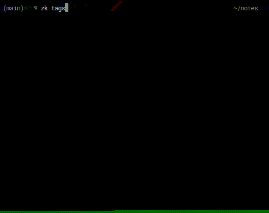

[](https://www.gnu.org/licenses/gpl-3.0)

# ZenKat

ZenKat is a tool and library to enable using a set of plaintext files, especially markdown files, as a [Zettelkasten](https://en.wikipedia.org/wiki/Zettelkasten) knowledge base.

I've used a number of knowledge management tools including Obsidian, Notion, and Coda, and have found them all lacking and / or designed in a way that makes them act as a walled garden. ZenKat is an attempt to create a lightweight FOSS alternative for command-line users. As such it aims to have few dependencies while still providing decent features.

It's named this way because of my bad memory for German. I remembered ZEttelKAsTen as ZenKat (unclear where the N came from).



## Recommended Setup

You can install directly from pip:

```
pip install zenkat
```

This also installs the `zenkat` convenience script.

If you'd like to run directly from source you can clone the repository and use [development mode](https://setuptools.pypa.io/en/latest/userguide/development_mode.html).

It's also worth installing [Marksman LSP](https://github.com/artempyanykh/marksman) if you plan on working with plaintext files a lot. This should work with major CLI editors including Helix, Neovim, and Spacemacs, as well as KATE. I use Helix.

For viewing files as formatted you can use [MD Fileserver]( https://github.com/commenthol/md-fileserver ) with `mdstart`.

`diff` comes by default on the command line and can be extremely helpful when combining duplicate notes (which Obsidian's multiple vaults tend to lead to).

## Usage

ZenKat supports basic filtering, formatting, and sorting of results based on the fields it indexes. As of version v0.0.10 it indexes documents, links, and tags and can recursively access properties. You can customise the output using `--format`.

```
zenkat list pages --filter "tags.name has writing" --format "{rel_path} {tags.name}"
```

One of the most powerful features of ZenKat is the ability to calculate backlinks and resolve paths:
```
zenkat list pages --sort "in_link_count asc"
```

It can correctly operate over dates using filters.

```
zenkat list pages --filter "created_at > Sep 25 2023"
```

You can also combine multiple filters, which will act like an AND statement.

```
zenkat list pages --filter "rel_path has business" --filter "rel_path has Client"
```

You can sort by fields using straightforward ascending / descending statements. Note that you can only sort on one field at the moment.

```
zenkat list pages --filter "rel_path has business" --sort "modified_at asc" --format "{modified_at} {filename}"
```

You can get a simple list of tags and then find which pages have those tags:

```
zenkat list tags
zenkat list pages --filter "any tags.name = daily"
```

### Fields

#### Pages
```

```

#### Tags
```


```

#### Links
```

```

### Filters

Currently filters use a basic 3-token structure, separated by spaces. The last argument can be multiple words long. The format of filters is:

```
rel_path has college stuff
<FIELD> <OPERATION> <VALUE>
```

Operations currently supported are:

```
=
>
<
>=
<=
has (opposite of in, works on sets, strings, and dicts)
```

### Sorting

You can sort by any non-compound field using the following syntax.

```
<FIELD> {asc / desc}
modified_at asc
```